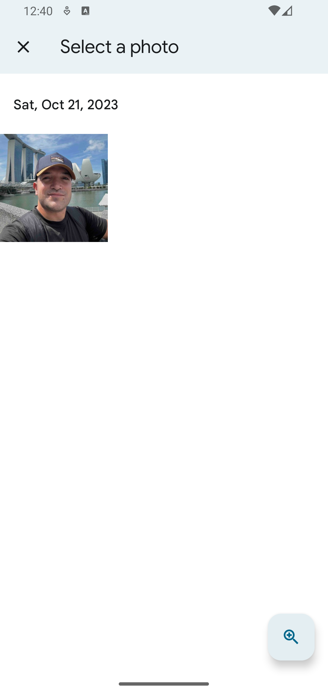

### Gemini Sample Project

**This is a sample app that comments and advises on style based on photos.** google_generative_ai and gemini-pro-vision model were used.

| 1. Click button   | 2. Select a photo | 3. Get advised    |
| ----------------- | ----------------- | ----------------- |
|  |  |  |

### Getting started

- Clone the repository
- In the project root directory, type:
  ```bash
  $ flutter create .
  ```
- [Get your API Key](https://aistudio.google.com/app/apikey) and edit your [config.json](config.json) file
- And then:
  - Type:
    ```bash
    $ flutter run -d <your-device-id> --dart-define-from-file="config.json"
    ```
  - Or edit [run.sh](run.sh) file and then, type:
    ```bash
    $ ./run.sh
    ```

### Extra:

While creating this project I made sure to show some things that might be useful for beginners; some of those:

- Dart environment definitions
- Bash scripts
- Image picker package
- Mime types
- Architecture
- Conditional operations and spread operator within lists